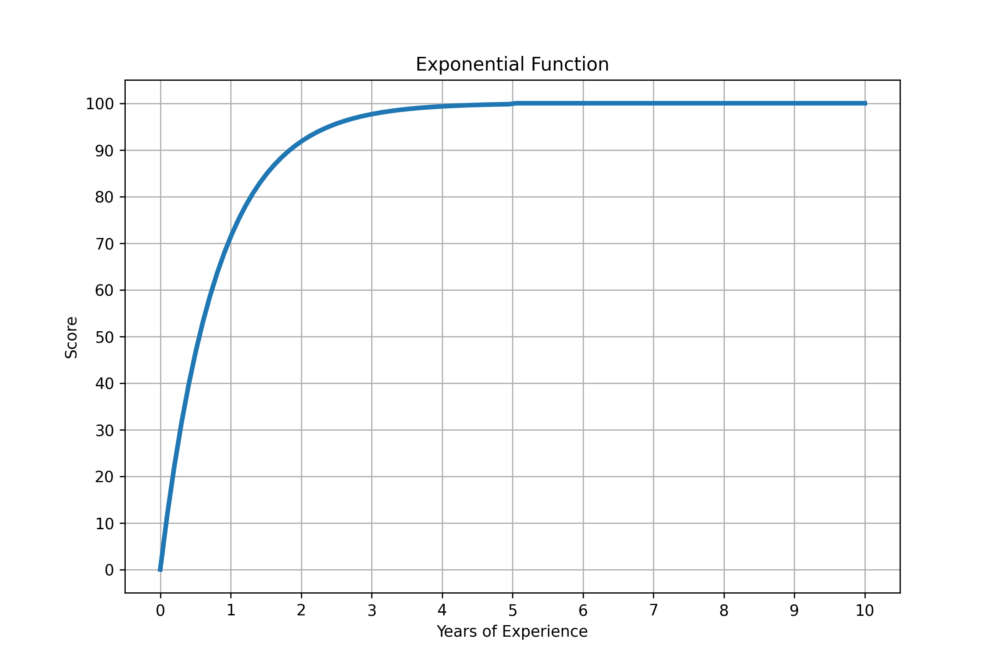

# CVSCout

LLM-based system and the Prompts needed to get a generative AI to help you assess a candidate's experience of a job offer.

## Index

- [Installation](#installation)
- [Usage](#usage)
- [How Score is Calculated](#how-score-is-calculated)
- [Repository Structure](#repository-structure)
- [Future Work](#future-work)

## Installation

```bash
pip install cvscout
```

## Usage

```python
from cvscout import CVScout, Candidato

JOB_TITLE = "Data Scientist"
CV = """
I'm Mario and I worked as a Data Scientist at Cognizant for 2 years.
"""

MODEL = "gpt-4-turbo"  # "gpt-4o" or "gpt-4-turbo"
cvscout = CVScout(model=MODEL)

# extract the response
try:
    info_candidato: Candidato = cvscout(JOB_TITLE, CV)
    print(f"Job title: {JOB_TITLE}")
    print("Candidate information:")
    print(info_candidato.model_dump_json(indent=4))
except Exception as e:
    print(f"An error occurred: {e}")
```

# How Score is Calculated

The score assigned to the candidate is calculated taking into account the work experience related to the job offer, rewarding the candidate's loyalty to the companies in which he has worked.

We are using an exponential function as we consider that the an important factor is that a candidate *just worked* on a similar position. The score looks like this:



Finally, to reward the loyalty of the candidate, we multiply the score by the number of months worked in the company.
If the candidate has worked just a few months, the score will be lower than if he has worked for a longer period of time.

## Repository Structure


The repository is structured as follows:

```
├── setup.py <- Metadata about the package and instructions on how to install it
│
├── DESCRIPTION.md <- Description of the project for PyPI
|
├── misc <- Folder for miscellaneous files
│
├── notebooks <- Folder where jupyter notebooks are located. Development purposes
│
├── data
│   └── example.py <- Example data for testing purposes
|
└── cvscout    <- Source code of the package
    ├── llm    <- LLM related code
    │   └── types.py <- LLM Object definitions
    ├── models <- Data models
    │   └── candidate.py <- Data model for the candidate
    ├── utils  <- Utility functions
    │   └── text.py <- Text processing functions
    └── main   <- CVScout main class to be used
```

## Future Work

- To determine more objectively whether a job is related to the position for which it is being applied, a taxonomy of jobs, tasks to be performed, skills required, etc. could be created. This information could be extracted from the job description and the candidate's experience and compared.
- The experience score could be adjusted for each offer according to what is more important: greater loyalty, longer working hours, ability to adapt, etc.